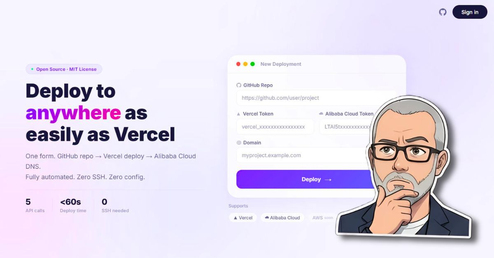

<div align="center">

# 🌉 DeployBridge


**One form. GitHub repo → Vercel deploy → Alibaba Cloud DNS. Zero SSH. Zero config.**

[Live Demo](https://maximosovsky.github.io/deploy-bridge/) · [Dev.to Article](https://dev.to/osovsky/i-tried-to-build-a-one-click-deployer-heres-what-actually-happened-o9d) · [Architecture](ARCHITECTURE.md)

</div>

> If a project runs on Vercel, it's just static files. If it's static, you can host it **anywhere**. That was the hypothesis. Then reality happened.



---

## 💡 Concept

DeployBridge is an experiment in cross-cloud deployment automation. The idea: paste a GitHub repo URL, Vercel token, Alibaba Cloud token, and a domain — click Deploy — and get a live site on Alibaba Cloud OSS with a custom domain.

**What I discovered:** the "one-click" promise requires 15 steps, 3 admin consoles, and 8 gotchas. The full story is in the [dev.to article](https://dev.to/osovsky/i-tried-to-build-a-one-click-deployer-heres-what-actually-happened-o9d).

---

## ✨ Features

| Feature | Status |
|---------|--------|
| Landing page (Luma-inspired design) | ✅ Live |
| Deploy static files to Alibaba Cloud OSS | ✅ Script |
| Bind custom domain to OSS bucket | ✅ Script |
| DNS verification (TXT + CNAME) | ✅ Script |
| SSL certificate via CAS API | ❌ Blocked ($40/yr) |
| GoDaddy DNS API integration | ❌ Blocked (paid tier) |
| Full automation (one-click) | ❌ 5 manual steps required |

---

## 🚀 Quick Start

```bash
git clone https://github.com/maximosovsky/deploy-bridge.git
cd deploy-bridge
npm install
```

<details>
<summary>⚙️ Environment Variables</summary>

Create a `.env` file:

```env
ALI_ACCESS_KEY_ID=your_key
ALI_ACCESS_KEY_SECRET=your_secret
ALI_REGION=oss-ap-southeast-1
ALI_BUCKET=your-bucket
VERCEL_TOKEN=your_token
GODADDY_KEY=your_key
GODADDY_SECRET=your_secret
```

</details>

### Deployment Scripts

```bash
# Deploy files to OSS
node deploy-to-oss.js

# Bind custom domain
node bind-domain.js

# Check SSL quota
node setup-ssl.js check
```

---

## 🏗️ Tech Stack

| Layer | Technology |
|-------|-----------|
| Landing page | HTML, CSS, JavaScript |
| Deployment | Node.js, [ali-oss](https://www.npmjs.com/package/ali-oss) |
| SSL | [@alicloud/cas20200407](https://www.npmjs.com/package/@alicloud/cas20200407) |
| Secrets | [dotenv](https://www.npmjs.com/package/dotenv) |
| Hosting | Alibaba Cloud OSS, GitHub Pages |

---

## 🐛 8 Gotchas Discovered

| # | Gotcha | Provider |
|---|--------|----------|
| 1 | Creating RAM user ≠ granting permissions | Alibaba Cloud |
| 2 | OSS activation requires $0.00 "purchase" | Alibaba Cloud |
| 3 | Default OSS domain forces file downloads | Alibaba Cloud |
| 4 | GoDaddy API requires paid plan for DNS | GoDaddy |
| 5 | Domain verification TXT goes to `_dnsauth.*` | Alibaba Cloud |
| 6 | Block Public Access silently overrides ACLs | Alibaba Cloud |
| 7 | "Free" SSL certificates cost $40/year | Alibaba Cloud |
| 8 | API signatures need alphabetically sorted params | Alibaba Cloud |

Full breakdown: [dev.to article](https://dev.to/osovsky/i-tried-to-build-a-one-click-deployer-heres-what-actually-happened-o9d)

---

## 📄 License

[Maxim Osovsky](https://www.linkedin.com/in/osovsky/). Licensed under [MIT](LICENSE).
